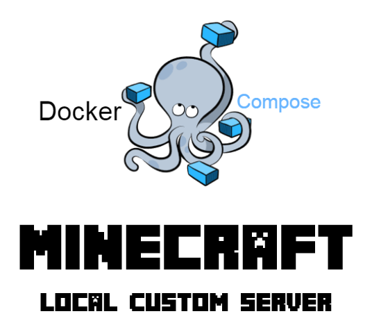
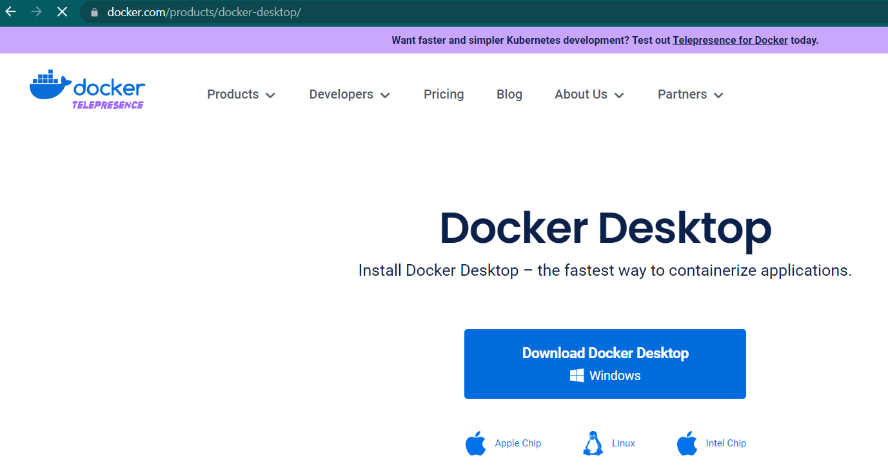

# Introduction

Docker is a program that allows you to run an application with all of the software dependencies and kernel components built in to the "container". One benefit to running a containerized version of an application is that it can be run on many different operating systems with different hardware and configuration. Unless otherwise configured to do so, containers do not store data on the machine they run on. 

Minecraft is an extremely popular game centered around crafting and survival. It is possible to run your own, or lease a server from a vendor for a monthly fee. There are also options that would allow you to create your server on your local workstation using a containerized version of the server software. We will need to configure persistent storage for our container if we want for our environment to be saved each time that we log out of the game.

In this lesson you will learn how to deploy a local version of Minecraft using the Docker Desktop software for Mac or Windows. If you are running a Linux based Operating system the docker and docker-compose packages would need to be installed.

Before we begin working with our docker-compose manifest file, we will need to download the Docker Desktop application for the Operating system we have installed on our computer. Once we have those components installed, we can begin to look over the manifest file that defines the details about our Minecraft deployment.

The *docker-compose.yml* manifest file provided for this exercise has all the information needed to build the following:
- The Minecraft server container which includes:
  - Persistent storage
  - Network port mapping
  - Environment variables to declare configuration parameters
  - Automatic restart of unhealthy container
- Minecraft backup agent container which includes:
  - Persistent storage
  - Backup scheduling
  - Old backup pruning to prevent storage issues
  - Automatic restart of unhealthy container

Once the *docker-compose.yml* file has been called upon by Docker, the containers will be pulled from the online repository and started up. The first time this process runs it takes a little longer since it needs to download the containers and cache them. Additionally, the first time the container is run it installs the Minecraft service and downloads the plugins selected in the manifest.

