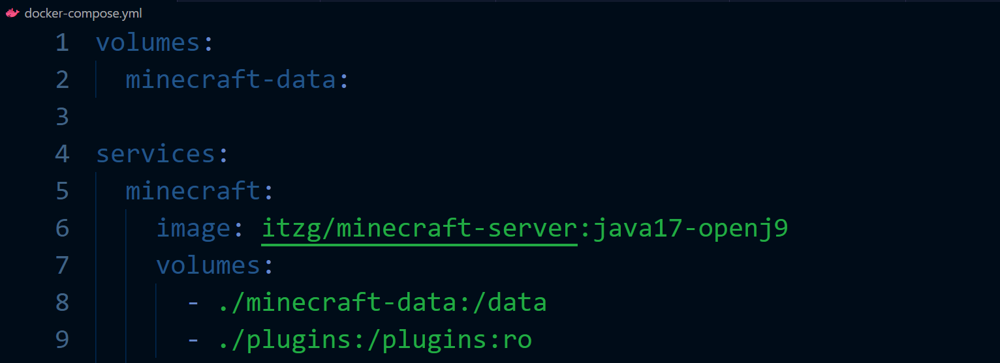
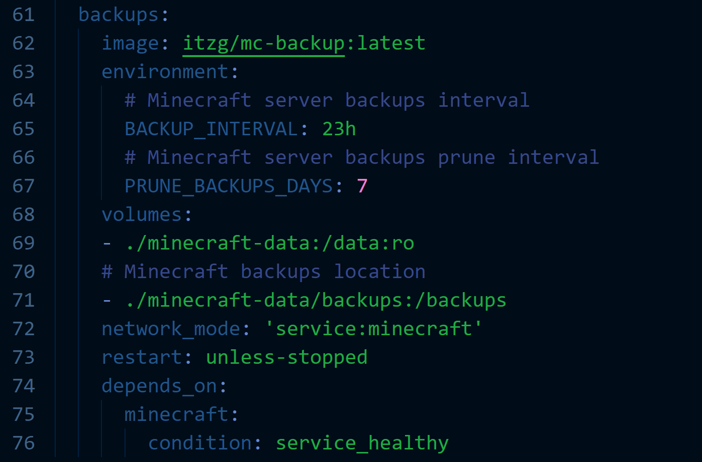

# How it works

As stated in the previous section, the docker-compose.yml manifest file provided for this exercise is a full map of our desired Minecraft application. Let's take a look at that file to analyze some of the information contained in that file, and understand what each part does.

The first 9 lines of the provided example define which vendor, container, and version, as well as persistent volume mount locations. 

For example under **services --> minecraft --> image** we can see the following:
- `Vendor - itzg` This is the minecraft image source
- `Container - minecraft-server` This is the Minecraft server container itself
- `Version - java17-openj9` In this example we have chosen a specific version. If you wanted a different version or wanted "latest" it would be changed here.

We can also see that 2 persistent volumes will be created to accomodate the Minecraft files and plugins under **services --> minecraft --> volumes** in the manifest.

Lines 10-56 are all configuration directives given to the container at run time and dictate the behavior of the environment. These directives come in the form of yaml formatted key value pairs. This is where all Minecraft customizations occur. Since the application is running in a container these are all declared as Environment Variables under **services --> minecraft --> environment**

In this example, we have provided a large number of Environment Variables to customize the environment to our liking. The only required Environment Variable is the `EULA: 'true'` which accepts the End User License Agreement. 

Read through the provided Environment variables, and feel free to change the values of any directives you want to use in your own environment. Ensure the original spacing is maintained for the *docker-compose.yml* file when updating the environment, as YAML syntax is sensitive to line indention.

Lines 57-58 declare the ports exposed by the application. When it reads 25565:25565 the first number represents the port used on the host. The second number represents the port listening on the container itself.

The last section, lines 61-76 is a separate container used to make regular backups of your configuration. 

The `BACKUP_INTERVAL: 23h` and `PRUNE_BACKUPS_DAYS: 7` directives set the interval and retention period for the backups. The service backups will be directed to `./minecraft-data/backups` on the local machine.

To get started, choose the lab button that corresponds with your currently running Operating System.

