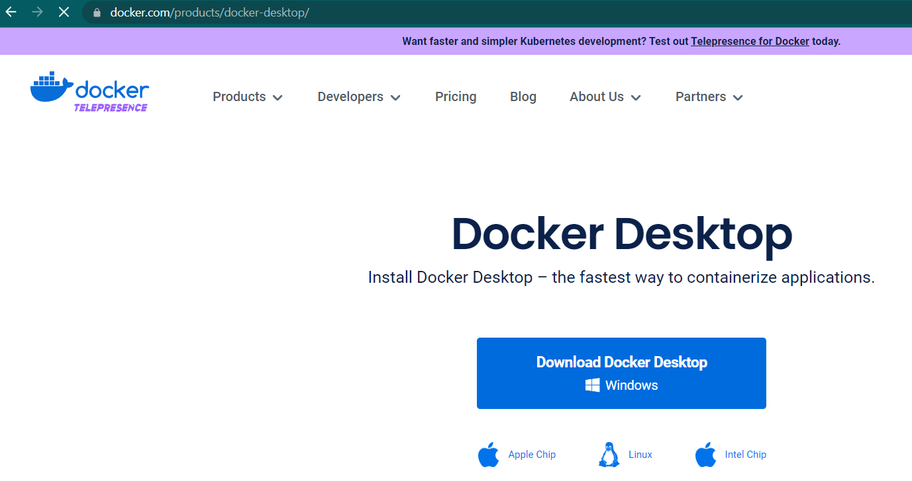
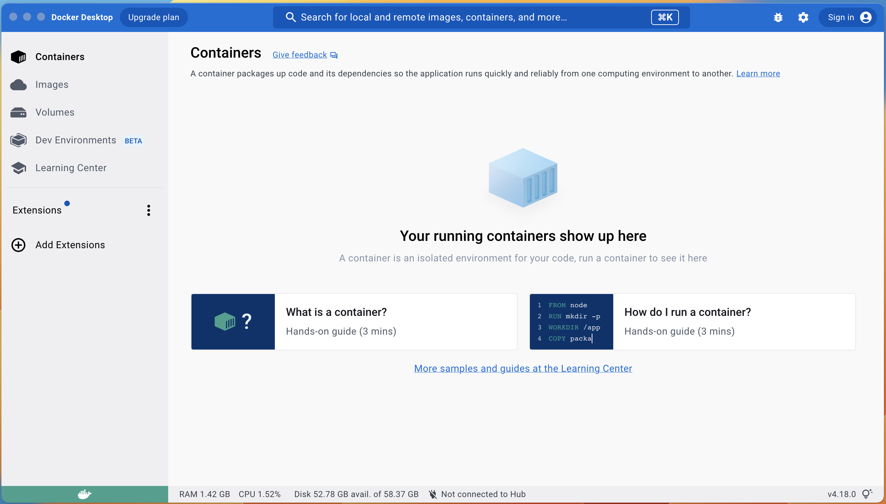
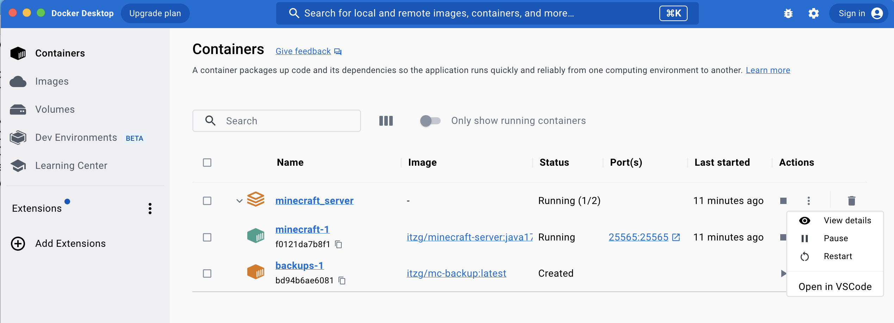
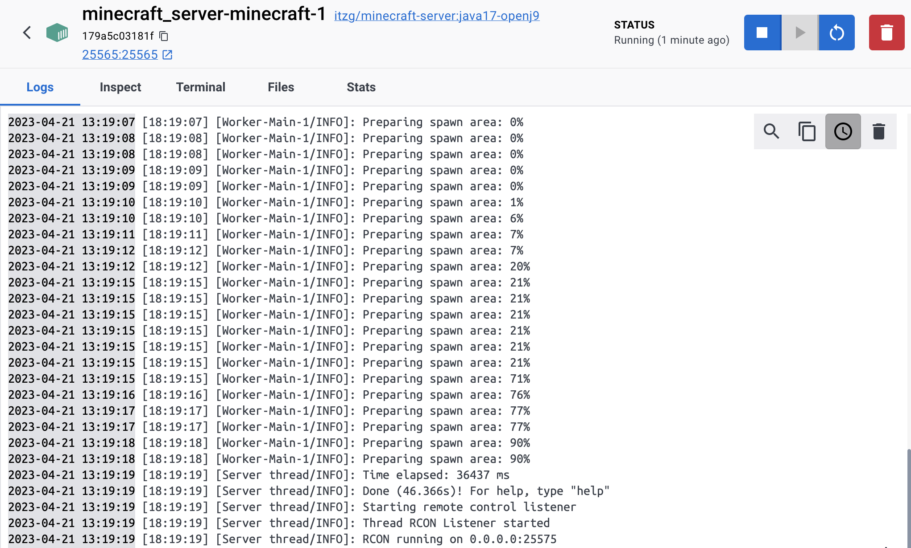

# Lab Exercise

In this section we will get hands-on experience and deploy our own Minecraft server. The first step to getting this configured it to download the Docker Desktop software that will be used to build and maintain your Minecraft deployment.

## Install Docker Desktop
 
**Step 1.** Navigate to [https://docker.com/products/docker-desktop](https://docker.com/products/docker-desktop) and download the installer for Docker Desktop.

**Step 2.** Once the file has downloaded, double click the `Docker Desktop Installer.exe` file to begin the install. Makes sure the checkbox for *Use WSL2 instead of Hyper-V (recommended)* is selected and click *Ok*. It is possible that the computer will require a reboot to complete this if it hasn't been installed before. Save your work, and reboot.

**Step 3.** Now that we have Docker Desktop installed, we can launch the application. This will give us a view into our running containers when we start them. You can start Docker Desktop from the desktop shortcut if you made one, or from the start menu if you opted out. Docker Desktop should look like this once running:

## Clone GitHub repo

Once Docker Desktop is installed and functional we will be ready to clone the GitHub repository for this course. To do this we will first need to install the git CLI for windows. 

**Step 1.** Download the windows git CLI installer from [https://git-scm.com/download/win](https://git-scm.com/download/win) and select the 64-bit Git for Windows Setup link.

**Step 2.** Double click *Git-2.40.0-64-bit.exe* file to begin the installation. Click Install. Once the installation finishes, we will be ready to clone down the github repository containing our files and folders. 

**Step 2.** Open Windows Powershell by clicking the start button and typing Powershell. In the resulting command prompt type the command shown here. 

`git clone https://github.com/OpenCloudJedi/Minecraft_Server.git`

**Step 5.** Before we start up our containers, we need to change directories to the newly downloaded directory.

`cd Minecraft_Server`

**Step 6** Choose your Minecraft settings (optional). Before starting our containers up, we may want to customize some of the settings. Open the *docker-compose.yml* file in your favorite editor and feel free to set it up how you wish. Again, ensure the original spacing is maintained for the *docker-compose.yml* file when updating the environment, as YAML syntax is sensitive to line indention. Save any changes you make to your file so those changes will be reflected in the Minecraft build.

**Step 7.** We are now ready to start up our containers based on that *docker-compose.yml* file. In the powershell window type the following command to instantiate the containers and install Minecraft.

`docker-compose up -d`

This step downloads the 2 container images and starts them up. The `-d` option we used in this command allows for the container to run in a "detached" session effectively allowing us to type additional commands at the command line. Minecraft is then installed in the main container. The data for that installation should populate in the persistent storage volumes we created `./minecraft_data` and `./plugins` in our working directory. 

## Viewing the container details

We can see our containers in the Docker Desktop application panel. If we want to see the logs from the installation and make sure everything is working as expected, you would select the three dots beside the running container and select *View Details*. 

This will reveal a log of activity on the Minecraft server. When the message *"RCON running on 0.0.0.0:25575"* is shown in the logs, the containers and your local Minecraft installation are ready to play. 

This means that the service is listening on all IP addresses on port 25575 for Minecraft client requests.

## Shutting down the Minecraft server container

In order to shut down our local Minecraft server we will return to the powershell window and type the following command:

`docker-compose down`

Keep in mind that if you added things to your minecraft realm, it can sometimes take a minute or two to be written to the persistent storage volume. A good rule of thumb is to wait perhaps 5 minutes before shutting down the container if significant edits were made during that game session.

