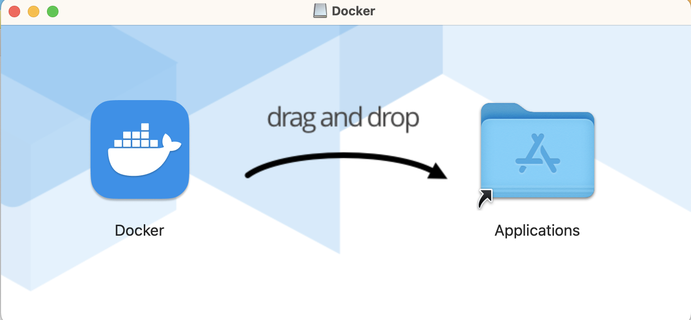
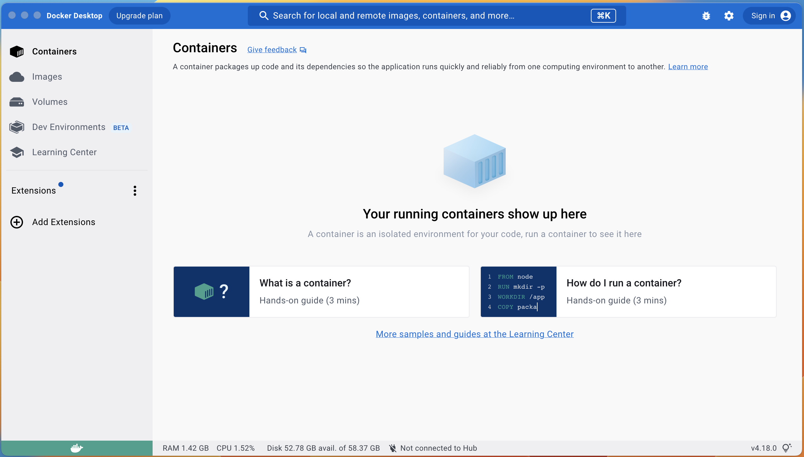
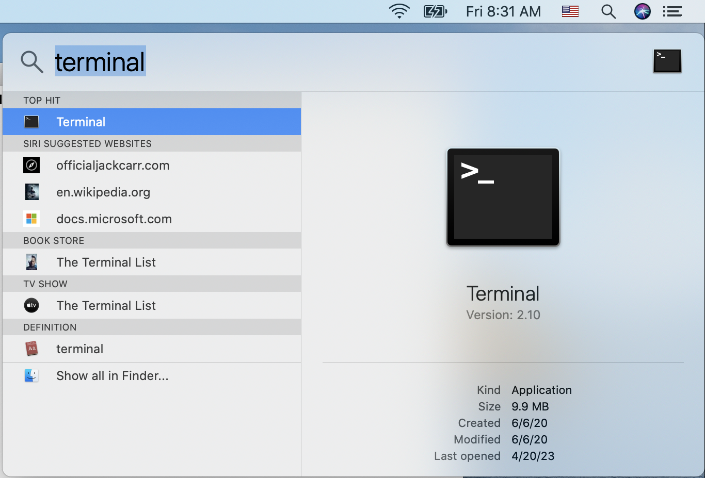
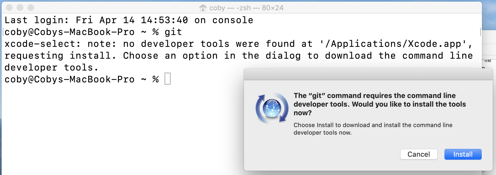
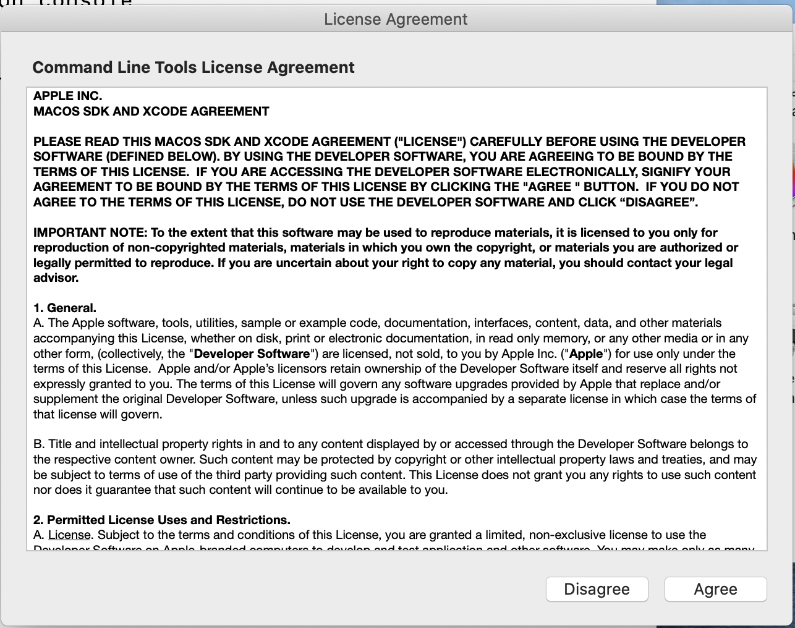
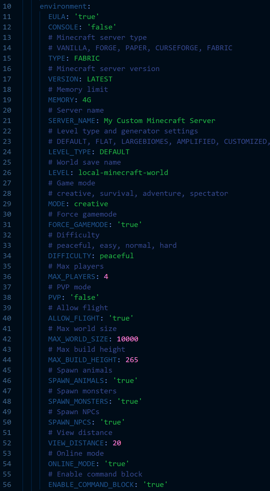
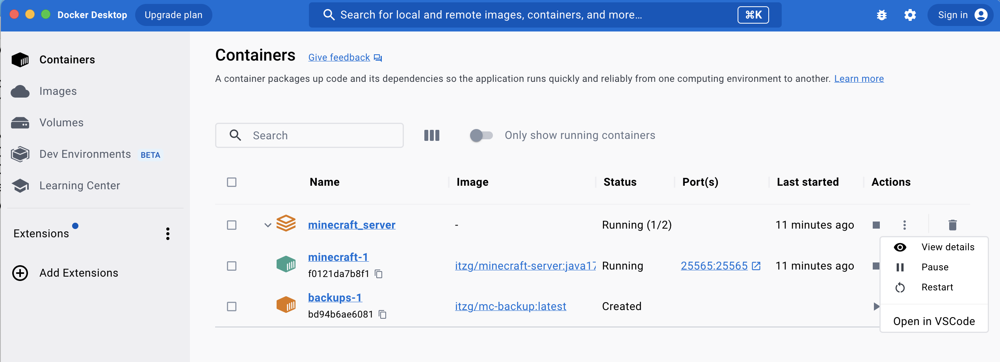
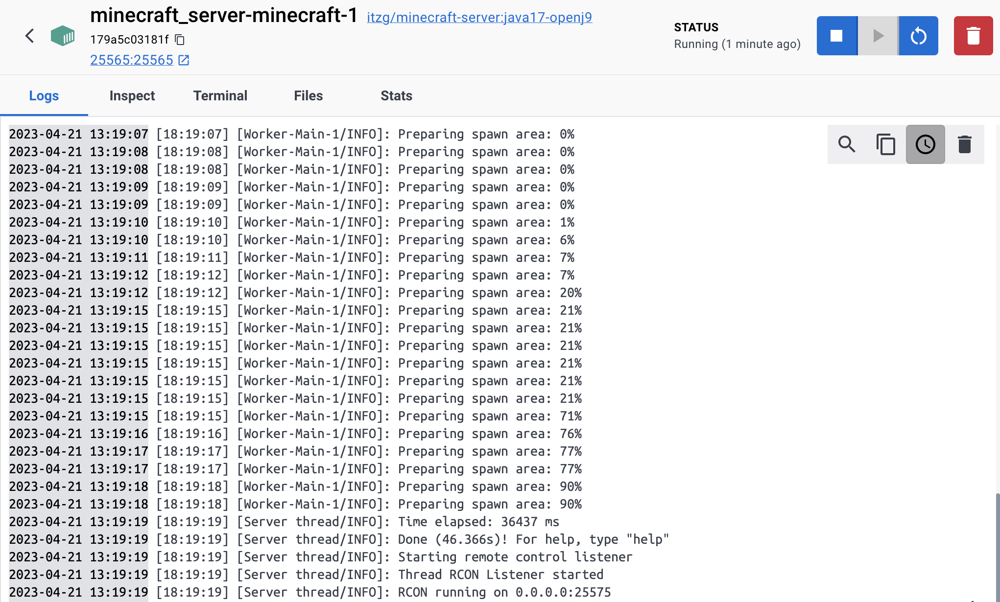

# Lab Exercise

In this section we will get hands-on experience and deploy our own Minecraft server. The first step to getting this configured it to download the Docker Desktop software that will be used to build and maintain your Minecraft deployment. 
## Install Docker Desktop
Each operating system has it's own installation instructions. 
- To install on Windows use the instructions found [here](https://docs.docker.com/desktop/install/windows-install/). If pre-requisite software needs to be installed in Windows such as WSL2, make sure you reboot the computer before attempting to use the docker service. 
- MacOS instructions can be found [here](https://docs.docker.com/desktop/install/mac-install/).

**Step 1.** Once the file has downloaded, click the `Docker.dmg` file to begin the install. Once the files are unpacked the icon needs to be dragged into the Applications folder.

**Step 2.** Now that we have Docker Desktop installed, we can launch the application. This will give us a view into our running containers when we start them. Navigate to your applications folder and double click the Docker Desktop icon to start the application. You can also drag the icon to the Dock for easier access if you choose. Docker Desktop should look like this:

## Clone GitHub repo

Once Docker Desktop is installed and functional we will be ready to clone the GitHub repository for this course. To do this we will first open the terminal for command line access. 

**Step 1.** Click the Magnifying glass in the upper right corner of the screen. In the resulting search box type the word `terminal`. Click the *terminal icon* to launch a command prompt.

**Step 2.** If git is already installed on your system, you can skip this step and step 3 in this section. In the terminal if you type the command `git` it will either supply you with the help document on git, or it will offer to install developer tools as shown here. Click Install:

**Step 3.** Installing the developer tools can take several minutes to complete. During the install, the agreement needs to be accepted to install:

**Step 4.** Now that we have git installed, we can clone this repository to download our MineCraft file and folders. At the command prompt type the following command:

`git clone https://github.com/OpenCloudJedi/Minecraft_Server.git`

**Step 5.** Before we start up our containers, we need to change directories to the newly downloaded directory.

`cd Minecraft_Server`

**Step 6** Choose your Minecraft settings (optional). Before starting our containers up, we may want to customize some of the settings. Open the *docker-compose.yml* file in your favorite editor and feel free to set it up how you wish. Again, ensure the original spacing is maintained for the *docker-compose.yml* file when updating the environment, as YAML syntax is sensitive to line indention. Save any changes you make to your file so those changes will be reflected in the Minecraft build.

**Step 7** We are now ready to start up our containers based on that *docker-compose.yml* file. In the terminal type the following command to instantiate the containers and install Minecraft.

`docker-compose up -d`

This step downloads the 2 container images and starts them up. The `-d` option we used in this command allows for the container to run in a "detached" session effectively allowing us to type additional commands at the command line. Minecraft is then installed in the main container. The data for that installation should populate in the persistent storage volumes we created `./minecraft_data` and `./plugins` in our working directory. 

## Viewing the container details

We can see our containers in the Docker Desktop application panel. If we want to see the logs from the installation and make sure everything is working as expected, you would select the three dots beside the running container and select *View Details*. 

This will reveal a log of activity on the Minecraft server. When the message *"RCON running on 0.0.0.0:25575"* is shown in the logs, the containers and your local Minecraft installation are ready to play. 

This means that the service is listening on all IP addresses on port 25575 for Minecraft client requests.

## Shutting down the Minecraft server container

In order to shut down our local Minecraft server we will return to the terminal window and type the following command:

`docker-compose down`

Keep in mind that if you added things to your minecraft realm, it can sometimes take a minute or two to be written to the persistent storage volume. A good rule of thumb is to wait perhaps 5 minutes before shutting down the container if significant edits were made during that game session.

